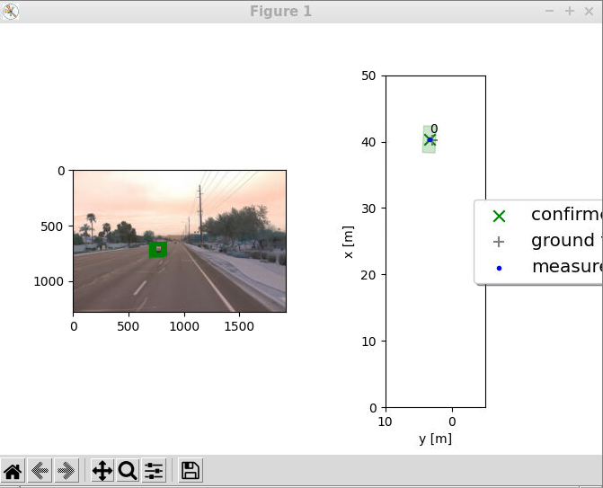
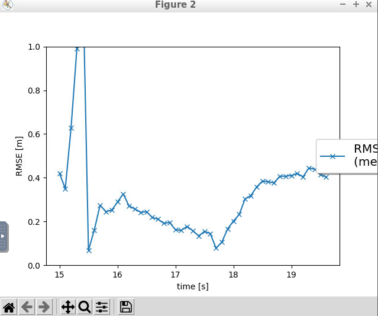
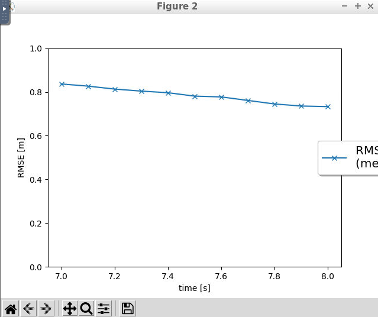
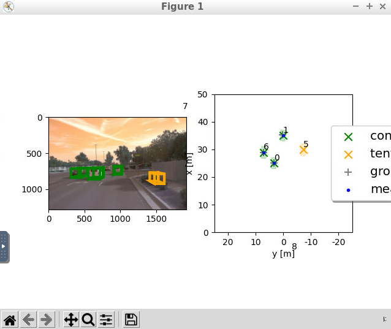
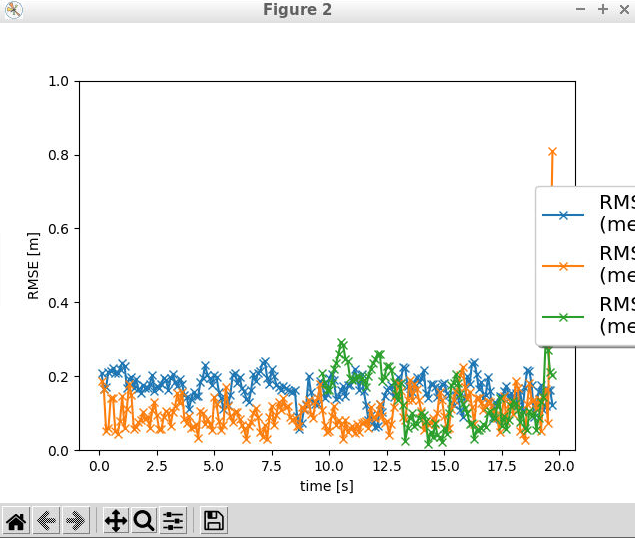

# Writeup: Track 3D-Objects Over Time

Please use this starter template to answer the following questions:

### 1. Write a short recap of the four tracking steps and what you implemented there (filter, track management, association, camera fusion). Which results did you achieve? Which part of the project was most difficult for you to complete, and why?

Step 1 is an Extended Kalman Filter. EKF has two actions or steps which are repeated over and over. One action is predicting the future location of the vehicle x and the covariance matrix P regarding it position with uncertainty noise. The other action is updating the vehicle's current position given he most recent measurement, which again incorporates another ucnertainty noise. Agin, same x and P are updated, but using other matrices this time for the calculation. The most important variable or matrix in the update step is the Kalman gain, whihc basically is a measure of the trade-off between how much we trust our odometry model vs how much we trust our sensor in their accuracy in performing their respective tasks.

Step 2 is a Track Management system. In other words, we are this time observing with the lidar sensor several vehicles driving, not just computing the Kalman filter for one vehicle, like in step 1. We have a list of tracks and one of measurements. A new track that appears is initialized with a score of 0.1666 and we observe the track over several time frames. If the trakc is associated with more measurements in the next time steps and its score increases over the 0.8 threshold, it gets the confirmed label. Track with score between 0.2 and 0.8 get a tentative label. A confirmed track gets deleted if its score drops below 0.6 or if its state covariance matrix P becomes too large (in our case a 3 meter radius)

Steps 3 is the Single Nearest Neighbor Data Association. We start with a matrix that keeps track of the distance between each track and each and every one measurement. We want to associate the smallest distance between tracks and measurements as being the correct pairs and in doing so we use the Mahalanobis distance, not the simple Euclidean distance, because we want to take into consideration that covariance matrix that expresses us the uncertainty in the car's position (which is like an imaginary ellipse around the car's measurement at that timestamp). We use a threshold for the Mahalanobis distance computed by the chi-square function to exclude probabilisticaly unlikely matches of track-measurement.

Step 4 is the camera sensor fusion together with the lidar from the steps before. The color camera sensor provides us with a 2D position, not a 3D one like the Lidar. So whereas for Lidar we use a linear H matrix for the Kalman Filter, for the camera we use a nonlinear h matrix that convert's from the vehicle's coordinate system XYZ (rooted at the middle of the car for example, where the lidar is mounted) to the camera's 2D coordinate system XY.

### 2. Do you see any benefits in camera-lidar fusion compared to lidar-only tracking (in theory and in your concrete results)? 
It is not just good, but mandatory to have several sensors and seval sensor types for autonomous driving vehicles. We want to avoid a single point of failure and we want to achieve an accuracy of over 99.999 with the algorithms, because otherwise it can cost human lives if the car crashes into pedestrians or other vehicles etc. Each sensor type has its advantages and disadvantages. For example the camera might help with RGB information color/brightness/contrast/texture in improving recognizing objects in the scene. The lidar on the other hand provides us accurate depth information, so how far the objects are located and is performing better than camera in certain weather or time conditions such as foggy/rainy/low lit dark environments. So having many sensors ensures that the car might drive safely irregardles of weather or lighting condition or unexpected rare situations occuring etc.

### 3. Which challenges will a sensor fusion system face in real-life scenarios? Did you see any of these challenges in the project?
Integrating many sensors in real time costs computation power. It means that the algorithms have to perform really well and fast, otherwise by the time we want to update the positions of some of our matrices and make decisions baded on that, we are many measurements lacking behind or something.
In simulations of real life scenarios one has to experiemtn with different values for the parameters we had in the params.py, not take some constant values as ultimate gold standard, and one has to tune the different noise matrices. A car's driving algorithm also has to adapt to its environment, for example driving in a city full of streets on hills is different than driving in a flat city, for the noise measurement on the z coordinate.
One also has to deal with occlusions of sensors, to realize that their current information is currently complete garbage and we have to rely on other sensors. 

### 4. Can you think of ways to improve your tracking results in the future?
One improvement is integrating information from lidar, radar, camera, stereo camera and microphones (to catch noise in the environment). 
Also experimenting with different algorithms apart from ResNet and Single Nearest Neighbor, some of which have bbeen mentioned in the course material.
